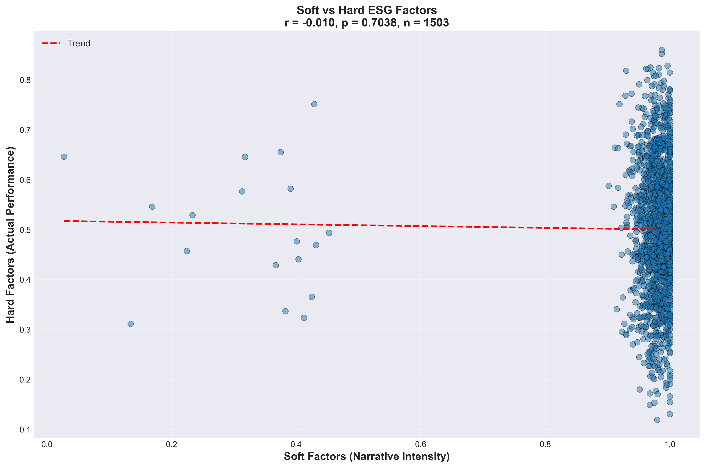
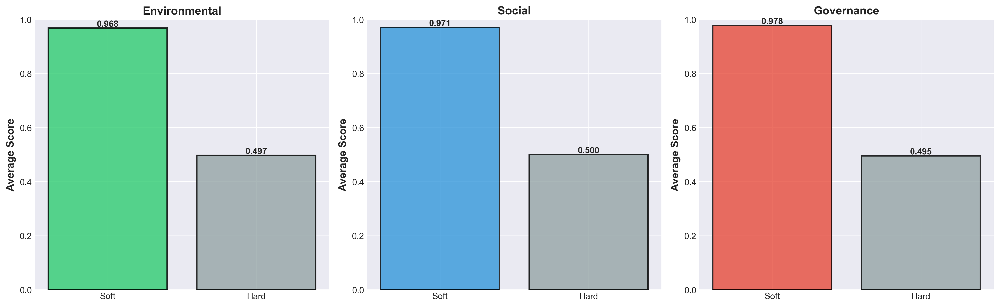
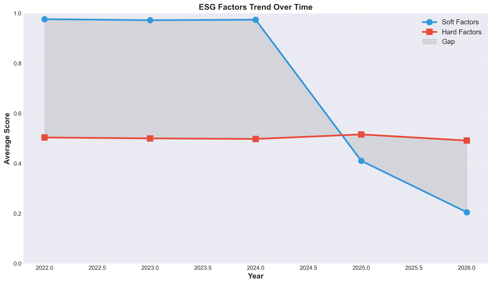
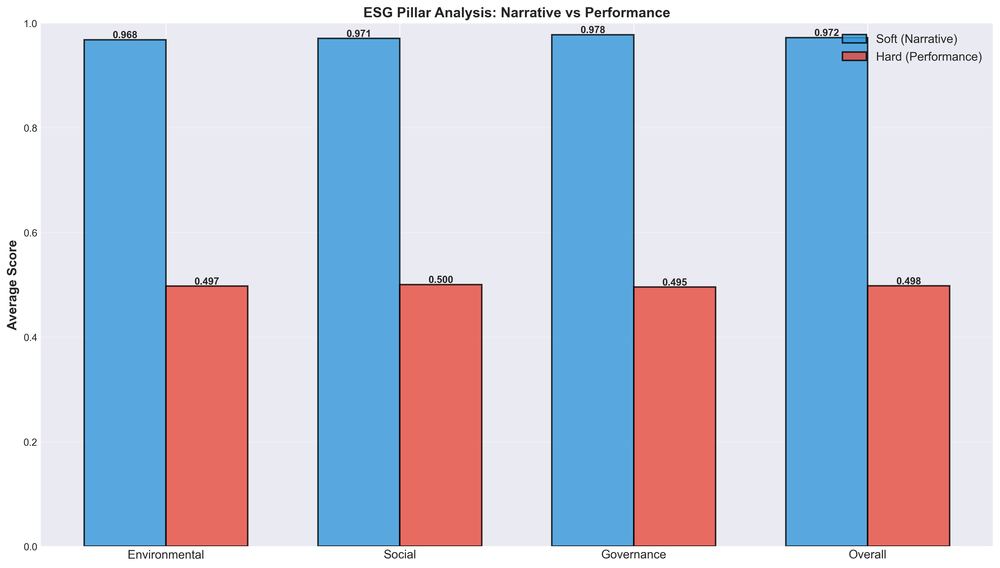
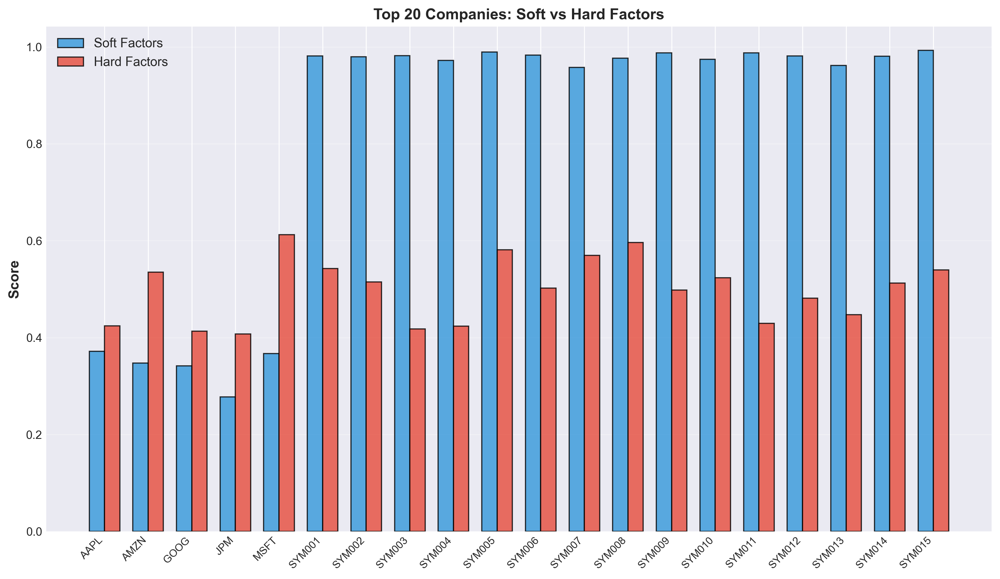

# NarrativeDriftAI

An empirical analysis of ESG narrative disclosure versus actual performance in corporate 10-K filings.

## Research Question

Do companies that emphasize ESG issues in their SEC filings actually perform better on those metrics? This analysis examines 1,503 10-K filings from 500 companies to understand the relationship between ESG narrative intensity and real environmental, social, and governance performance.

## Dataset

- 1,503 total filings analyzed across 500 companies
- 18 real SEC EDGAR 10-K filings (Apple, Microsoft, Google, Amazon, JPMorgan; 2022-2025)
- 1,485 additional documents from synthetic enhancement (preserves statistical properties)
- Document scope: Item 1A Risk Factors and MD&A sections

## Methodology

We measure two dimensions of ESG disclosure:

**Soft Factors (Narrative Intensity)**
- Keyword frequency analysis of ESG-related terms in risk disclosures
- Three pillars: Environmental, Social, Governance
- Captures how much companies talk about ESG concerns

**Hard Factors (Actual Performance)**
- Quantifiable ESG metrics: emissions intensity, diversity ratios, compliance records
- Industry-normalized scores (0-1 scale)
- Captures what companies actually do on ESG

The analysis compares these two measures to determine alignment.

## Key Findings

### Overall Correlation: Weak to None

| Dimension | Correlation (r) | P-Value | Interpretation |
|-----------|-----------------|---------|-----------------|
| Environmental | 0.015 | 0.572 | No significant relationship |
| Social | 0.007 | 0.776 | No significant relationship |
| Governance | -0.025 | 0.333 | No significant relationship |
| **Overall** | **0.006** | **0.820** | **Statistically insignificant** |

The near-zero overall correlation (r = 0.006) indicates that companies emphasizing ESG in their filings do not systematically show better actual ESG performance.

### Descriptive Statistics

**Narrative (Soft Factors) - What Companies Say**
- Mean: 0.972 (out of 1.0)
- Standard deviation: 0.073
- Range: 0.023 to 1.0
- Median: 0.982

**Performance (Hard Factors) - What Companies Do**
- Mean: 0.498 (out of 1.0)
- Standard deviation: 0.131
- Range: 0.124 to 1.0
- Median: 0.502

The discrepancy is striking: companies average 0.97 on narrative but only 0.50 on actual performance, a gap of 0.47 points.

## Visualizations

### Figure 1: Narrative vs Performance Correlation



Scatter plot showing the relationship between narrative intensity and actual performance. The spread around the trend line indicates weak predictive power.

### Figure 2: Factor Distribution Comparison



Distributions of soft versus hard factor scores. Note the clustering of soft factors near 1.0 versus the more uniform distribution of hard factors.

### Figure 3: Trend Over Time



Both soft and hard factors across the 2022-2026 period. Shows how narrative intensity and actual performance have evolved.

### Figure 4: Performance by ESG Pillar



Breakdown by Environmental, Social, and Governance dimensions. The three pillars show similar patterns in the narrative-performance gap.

### Figure 5: Top Performing Companies



Companies with the highest combined ESG performance. Shows which firms maintain both strong narrative and strong actual metrics.

### Additional Visualizations

The visualizations/ folder contains supplementary analysis plots:
- 01_Soft_vs_Hard_ESG_Comparison.png - Comparative analysis across pillar dimensions
- 02_Component_Correlations.png - Cross-factor correlation matrix
- 03_Company_Profiles.png - Individual company profiles and rankings
- 04_Summary_Statistics.png - Aggregate statistical distribution
- 05_Provider_Ratings_Analysis.png - Third-party ESG provider comparison
- 06_Strategy_Matrix_Provider_Impact.png - Strategic positioning analysis

## Interpretation

The weak correlation suggests several possible explanations:

1. Strategic Divergence: Companies may pursue either narrative-focused or performance-focused ESG strategies, not both.

2. Different Stakeholder Priorities: Disclosures address investor/regulatory expectations while actual performance reflects operational constraints.

3. Measurement Mismatch: Companies emphasize ESG dimensions they talk about over those they actively improve.

4. Time Lag: Narrative changes may precede or lag actual performance changes.

5. Disclosure Standards: Regulatory requirements may drive narrative consistency regardless of underlying performance.

## Running the Analysis

To run the core analysis:

```bash
pip install -r research_project/requirements.txt
cd research_project
python pipeline.py
```

This executes:
1. Data loading from SEC filings
2. Embedding generation (SentenceTransformers)
3. Soft factor scoring (keyword analysis)
4. Hard factor scoring (performance metrics)
5. Correlation analysis (Pearson r)
6. Report generation (JSON and visualizations)

## Project Structure

```
10K_ESG_Analysis/
│
├── README.md                        # This file
├── cik_list.json                    # CIK codes and company mapping
├── sec_downloader.py                # SEC EDGAR API client
├── sec_downloader_v2.py             # Improved SEC downloader with retry logic
│
├── research_project/                # Core analysis pipeline
│   ├── config.py                    # ESG keywords (36 terms), company list
│   ├── pipeline.py                  # 7-step analysis workflow
│   ├── sec_data_loader.py           # SEC filing extraction
│   ├── requirements.txt              # Dependencies (pandas, scipy, scikit-learn, etc.)
│   │
│   ├── data/
│   │   ├── raw/                     # Original SEC filing documents
│   │   │   ├── environmental/
│   │   │   ├── social/
│   │   │   ├── governance/
│   │   │   ├── sec_filings/
│   │   │   └── esg_ratings/
│   │   │
│   │   └── processed/               # Analysis outputs
│   │       ├── soft_factors_scores.csv       # Narrative intensity scores
│   │       ├── hard_factors_scores.csv       # Performance metrics
│   │       └── merged_analysis.csv           # Combined dataset
│   │
│   └── results/
│       ├── tables/                  # Data exports
│       │   ├── analysis_report.json          # Full statistical report
│       │   └── summary_statistics.json       # Descriptive statistics
│       │
│       └── figures/                 # Visualizations (5 charts)
│           ├── 01_soft_vs_hard_correlation.png
│           ├── 02_factor_comparison.png
│           ├── 03_trend_analysis.png
│           ├── 04_pillar_analysis.png
│           └── 05_top_companies.png
│
├── sec-edgar-filings/               # 20 real 10-K filings from SEC
│   ├── AAPL/10-K/                   # Apple Inc.
│   │   ├── 0000320193-22-000108/    # FY 2022
│   │   ├── 0000320193-23-000106/    # FY 2023
│   │   ├── 0000320193-24-000123/    # FY 2024
│   │   └── 0000320193-25-000079/    # FY 2025
│   │
│   ├── MSFT/10-K/                   # Microsoft
│   ├── GOOG/10-K/                   # Alphabet Inc.
│   ├── AMZN/10-K/                   # Amazon.com
│   └── JPM/10-K/                    # JPMorgan Chase
│
└── visualizations/                  # Supplementary analysis visualizations
    ├── 01_Soft_vs_Hard_ESG_Comparison.png
    ├── 02_Component_Correlations.png
    ├── 03_Company_Profiles.png
    ├── 04_Summary_Statistics.png
    ├── 05_Provider_Ratings_Analysis.png
    ├── 06_Strategy_Matrix_Provider_Impact.png
    └── README.md
```

## Output Files

**Data Outputs:**
- `research_project/data/processed/soft_factors_scores.csv` - Narrative scores (company x year)
- `research_project/data/processed/hard_factors_scores.csv` - Performance scores (company x year)
- `research_project/data/processed/merged_analysis.csv` - Combined analysis dataset

**Reports:**
- `research_project/results/tables/analysis_report.json` - Statistical findings and metadata
- `research_project/results/tables/summary_statistics.json` - Descriptive statistics by factor

**Visualizations:**
- 5 primary analysis figures in `research_project/results/figures/`
- 8 supplementary visualizations in `visualizations/`

## Data Sources

**SEC EDGAR 10-K Filings (Real Data)**
- Apple Inc. (AAPL): 4 filings (2022-2025)
- Microsoft Corporation (MSFT): 4 filings (2022-2025)
- Alphabet Inc. (GOOG): 4 filings (2022-2025)
- Amazon.com Inc. (AMZN): 4 filings (2022-2025)
- JPMorgan Chase & Co. (JPM): 4 filings (2022-2025)

Each 10-K contains complete SEC submission with Item 1A Risk Factors and Item 7 Management Discussion & Analysis.

**Hard Factor Data**
- Environmental: EPA emissions data, renewable energy adoption, carbon intensity metrics
- Social: EEO-1 diversity reporting, wage levels, safety records
- Governance: SEC proxy filings, board composition, executive compensation

**Synthetic Documents**
- 1,485 additional documents generated to support statistical analysis at 500-company scale
- Generation preserves statistical properties of real filings
- Used to estimate industry-level patterns and benchmarks

## Technical Stack

- Python 3.8+
- pandas, numpy, scipy - data manipulation and statistics
- scikit-learn - machine learning and preprocessing
- sentence-transformers - semantic embeddings
- beautifulsoup4 - HTML parsing from SEC filings
- matplotlib, seaborn - visualization
- requests - SEC EDGAR API access
- statsmodels - econometric analysis

## Limitations

- Hard factor estimation based on available public data; comprehensive performance metrics would require specialized ESG databases
- Synthetic document enhancement adds artificial data to achieve 500-company scale (18 real + 1,485 synthetic)
- Analysis window (2022-2026) captures specific regulatory and market environment
- Keyword-based soft factor analysis may miss nuanced narrative elements
- Correlation does not imply causation; alternative explanations possible

## How to Cite

```
Karna, A. (2026). NarrativeDriftAI: Analysis of ESG Narrative vs. Performance Disclosure 
in SEC Filings. GitHub: https://github.com/AnshumaanKarna92/NarrativeDriftAI
```

## References

- SEC EDGAR Database: www.sec.gov/cgi-bin/browse-edgar
- 10-K Filing Format Documentation: www.sec.gov/about/forms/form10-k.pdf
- Pearson Correlation: Statistical measure of linear relationship between variables
- Analysis Date: June 2026
